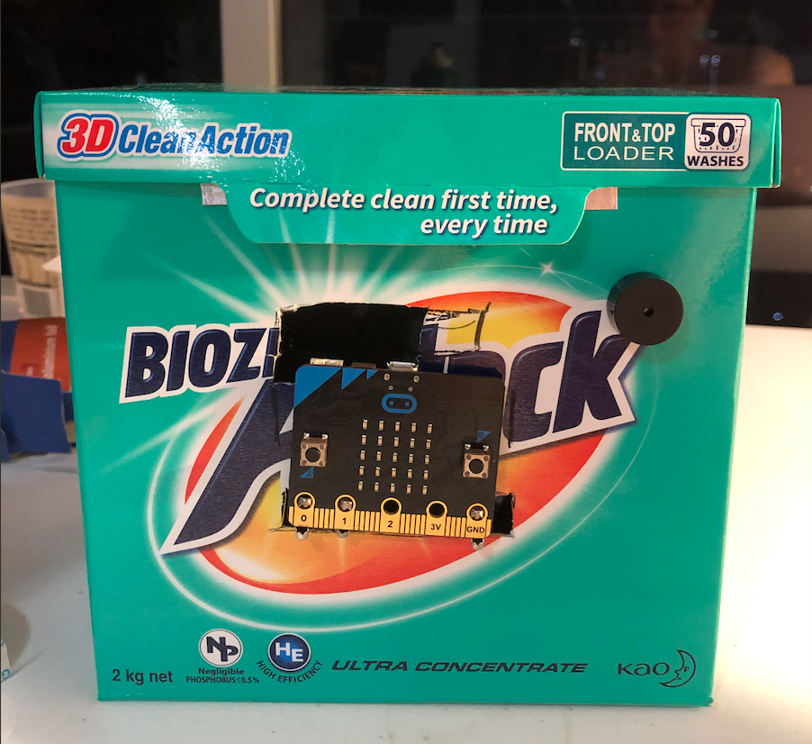
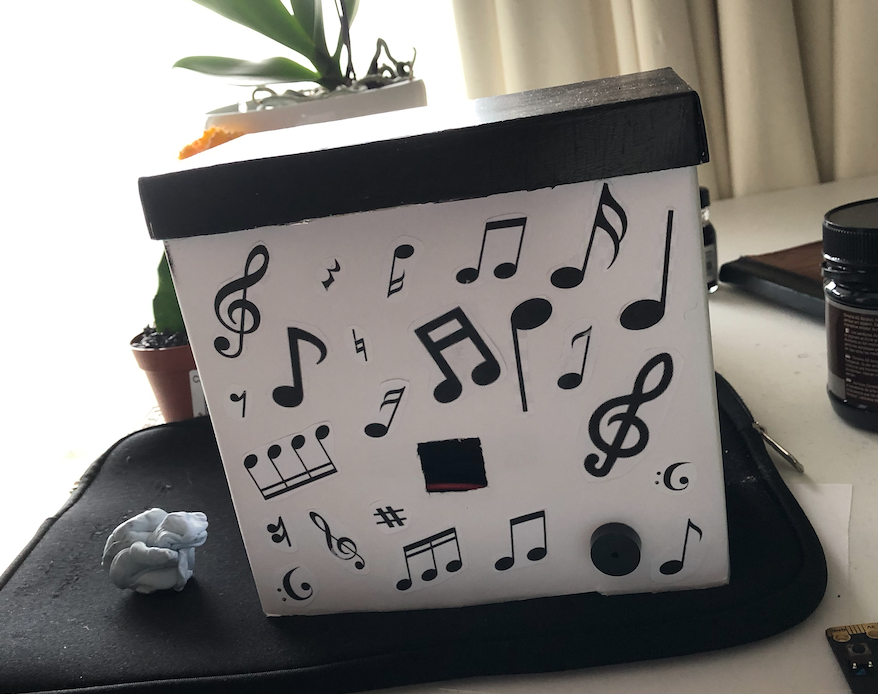

# 1701QCA Final project journal: *Lily Nolann  *

<!--- As for other assessments, fill out the following journal sections with information relevant to your project. --->

<!--- Markdown reference: https://guides.github.com/features/mastering-markdown/ --->

## Related projects ##
<!--- Find about 6 related projects to the project you choose. A project might be related through  function, technology, materials, fabrication, concept, or code. Don't forget to place an image of the related project in the appropriate folder and insert the filename in the appropriate places below. Copy the markdown block of code below for each project you are showing. --->

### Interactive Mario Mushroom Block ###

<!--- Modify code to insert image of related project below --->

<!--- Fill out name and link to related project in the code below. --->
[Interactive Mario Mushroom Block](https://create.arduino.cc/projecthub/sclandinin/interactive-mario-mushroom-block-2235dd)

<!--- Include information about why this project is related to yours. --->
This project is related to mine because it involves interacting with a box to make it open. I like how the box is decorated and the fun sounds that it makes when interacted with. It is similar to mine also because it is a simple interaction.

### *Star Wars Theme Song on Microbit* ###

<!--- Modify code to insert image of related project below --->

<!--- Fill out name and link to related project in the code below. --->
[Star Wars Theme Song on Microbit](https://makecode.microbit.org/v0/64323-10091-30877-83077)

<!--- Include information about why this project is related to yours. --->
This project is related to mine because it also uses microbit block code to create a melody. 

### *Escape Room Puzzle Box* ###

<!--- Modify code to insert image of related project below --->

<!--- Fill out name and link to related project in the code below. --->
[Escape Room Puzzle Box](https://www.youtube.com/watch?v=Y84joDbEV3w)

<!--- Include information about why this project is related to yours. --->
This project is related to mine because it's also a handmade electronic puzzle box. I liked how the puzzle was intuitive and did not need any instructions for the user to figure out how it worked

## Other research ##
<!--- Include here any other relevant research you have done. This might include identifying readings, tutorials, videos, technical documents, or other resources that have been helpful. For each particular source, add a comment or two about why it is relevant or what you have taken from it. You should include a reference or link to each of these resources. --->

I used youtube piano tutorials to help write the abba rifts into the microbit block code

https://www.youtube.com/watch?v=Nnp1bLb_FJI
https://www.youtube.com/watch?v=SZOqlq3ab8M

## Conceptual development ##

### Design intent ###
To create an interactive puzzle box 

### Design ideation ###
<!--- Document your ideation process. This will include the design concepts presented for assessment 2. You can copy and paste that information here. --->
### Design concept 1 ###

My first idea was an electronic pet. lots of people have been wanting pets in the last few weeks since we have been stuck inside. I think that an electronic household pet could be helpful for people who can't get a pet right now. I would want the pet to have a few simple commands that had randomised outcomes. My idea is to create a toy where the microbit LEDs are the interface.

### Design concept 2 ###
My second idea was an alarmed cookie jar to stop people stealing your snacks. I felt that this would be useful whilst in isolation to stop people from having too many cookies by shaming them. The cookie jar could say sarcastic things when opened such as "Do you really need that?" and "Wow that's 3 today." Basically everything your mother would say if she was around.

### Design concept 3 ###
My third concept is to make a puzzle box that contains sweets. Following on from my second design concept, this design will protect your snacks from others in a fun and entertaining way. With an alarm that goes off if the box is opened without solving the problem and a puzzle/ passcode to keep people away from your treats.

### Final design concept ###
My final concept is an ABBA themed puzzle box that gives clues to the user by playing ABBA rifts. If the box is opened without the code "A-B-B-A" an alarm goes off. Each time an incorrect code is put in, an ABBA rift is played.

### Interaction flowchart ###
<!--- Include an interaction flowchart of the interaction process in your project. Make sure you think about all the stages of interaction step-by-step. Also make sure that you consider actions a user might take that aren't what you intend in an ideal use case. Insert an image of it below. It might just be a photo of a hand-drawn sketch, not a carefully drawn digital diagram. It just needs to be legible. --->

## Process documentation ##
<!--- In this section, include text and images (and potentially links to video) that represent the development of your project including sources you've found (URLs and written references), choices you've made, sketches you've done, iterations completed, materials you've investigated, and code samples. Use the markdown reference for help in formatting the material.

This should have quite a lot of information! It will likely include most of the process documentation from assessment 2 which can be copied and pasted here.

Use subheadings to structure this information. See https://guides.github.com/features/mastering-markdown/ for details of how to insert subheadings.

There will likely by a dozen or so images of the project under construction. The images should help explain why you've made the choices you've made as well as what you have done. --->
Here is where I left off at the end of assessment 2:

Decorating the box to make it look resectable:

Taping down all of the inner circuit connections:

Mamma Mia rift code:

Dancing Queen rift code:

## Final code ##

<!--- Include here screenshots of the final code you used in the project if it is done with block coding. If you have used javascript, micropython, C, or other code, include it as text formatted as code using a series of three backticks ` before and after the code block. See https://guides.github.com/features/mastering-markdown/ for more information about that formatting. --->

## Design process discussion ##
<!--- Discuss your process used in this project, particularly with reference to aspects of the Double Diamond design methodology or other relevant design process. --->
A challenge that I faced was making the box a combination code. I researched other combination javascript code and found the way that worked best for me was to create "states." The code would move to the next state when the correct part of the combination was put in and if the wrong button was pressed then the state would revert back to 0. The alarm would be disarmed when the state reached 4 and the user would be able to open the box. Another challenge that I faced was making my project a spectifc theme that was interesting to use. I decided to explore music because I had the buzzer which was easy to attatch to the microbit and code. I then assesed that I had the buttons "A" and "B" in my microbit and decided that ABBA would be the theme of my puzzle box. I found that this theme was easy to deliver without being obvious and keeping the user engaged with the puzzle.

## Reflection ##

<!--- Describe the parts of your project you felt were most successful and the parts that could have done with improvement, whether in terms of outcome, process, or understanding.

I felt that my presentation and decoration of the box was very sucsessful and aesthetically pleasing. I think that my ABBA rifts weren't as instantly recognisable as I would like. In testing lots of people needed to be prompted to understand what song was playing.

What techniques, approaches, skills, or information did you find useful from other sources (such as the related projects you identified earlier)?
I found sources that I felt were useful for my project and gave me inspiration to make mine more interactive and fun to use. The Mario Block project gave me inspiration to decorate my project a specific theme and the Star Wars music code helped me to write my own rendition of popular music. 

What parts of your project do you feel are novel? This is IMPORTANT to help justify a key component of the assessment rubric.

I feel that the musical element of my project is novel. When the user recognises the tune, puts in the correct combination and sees the tick appear, it is very rewarding and not an experience that you would have in a regular day. I also think that it is aesthetically pleasing and is an interesting object that people are inquisitive about when they see it.

What might be an interesting extension of this project? In what other contexts might this project be used? --->

A fun extension for this project would be to have the combination change and the music change to match that combination. To have a rifts from other artists play and the code is the artist's name of whatever music is playing. Another context that this project could be used in is a kids educational toy. For example, it could have different coulered buttons and say the name of a colour and the kid has to press that coloured button to be rewarded.
